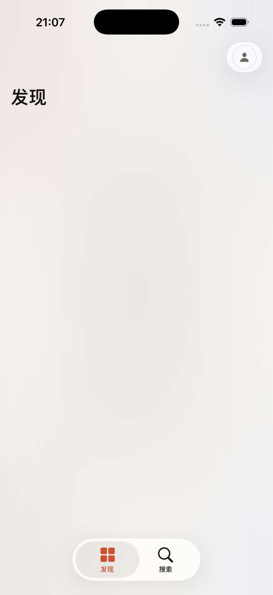

# Oto

Oto is a SwiftUI iOS music app built around the NetEase Cloud Music ecosystem. The current app includes login-aware discovery, search, album/artist/playlist browsing, background playback, lock-screen controls, and offline downloads.



## Highlights

- SwiftUI app architecture with shared service singletons for playback, session, downloads, and caching
- NetEase-backed discovery and personalized shelves
- Full-screen now-playing experience with lyrics, queue management, and transport controls
- Offline download flow with persisted playback/download state
- Fastlane lanes for internal TestFlight distribution

## Tech Stack

- Swift 6
- SwiftUI
- Xcode project: `Oto.xcodeproj`
- iOS deployment target: 26.0
- Dependencies:
  - [`NeteaseCloudMusicAPI-Swift`](https://github.com/Lincb522/NeteaseCloudMusicAPI-Swift)
  - `Nuke`

## Project Layout

- `Oto/` app source
- `OtoTests/` unit tests
- `Config/` checked-in public-safe config plus local override template
- `fastlane/` release automation

## Requirements

- Xcode 17 or newer with iOS simulator runtimes installed
- Ruby/Bundler for fastlane workflows

## Getting Started

### 1. Clone the repository

```sh
git clone https://github.com/Morris-Lau/Oto.git
cd Oto
```

### 2. Install Ruby dependencies

```sh
bundle install
```

### 3. Optional local signing override

The repository ships with public-safe placeholder identity values in `Config/Identity.xcconfig`.

If you want to run on a real device or archive/TestFlight-build the app, copy the local override template and fill in your own values:

```sh
cp Config/Local.xcconfig.example Config/Local.xcconfig
```

Then set:

- `APP_BUNDLE_ID`
- `APP_TEST_BUNDLE_ID`
- `APPLE_DEVELOPMENT_TEAM`

`Config/Local.xcconfig` is gitignored and should stay local.

## Build

List the available scheme:

```sh
xcodebuild -project Oto.xcodeproj -list
```

Build for the simulator:

```sh
xcodebuild -project Oto.xcodeproj -scheme Oto -destination 'platform=iOS Simulator,name=iPhone 17' build
```

## Test

Run the test target:

```sh
xcodebuild -project Oto.xcodeproj -scheme Oto -destination 'platform=iOS Simulator,name=iPhone 17' test
```

## Release

Fastlane lanes:

```sh
bundle exec fastlane ios beta
bundle exec fastlane ios upload_testflight
```

For TestFlight upload you will also need App Store Connect credentials via environment variables or a local setup supported by `fastlane/Fastfile`.

## Privacy and Local Secrets

- Do not commit `Config/Local.xcconfig`
- Do not commit `.env`, provisioning profiles, signing certificates, or local deploy scripts
- Keep any device-specific or account-specific configuration in ignored local files only

## Contributing

Please read [CONTRIBUTING.md](CONTRIBUTING.md) before opening a pull request.

## Security

Please report vulnerabilities following [SECURITY.md](SECURITY.md).

## License

This project is licensed under the [MIT License](LICENSE).

## Third-Party Software

See [THIRD_PARTY_NOTICES.md](THIRD_PARTY_NOTICES.md) for dependency license notes.

## Acknowledgements

- [`Lincb522/NeteaseCloudMusicAPI-Swift`](https://github.com/Lincb522/NeteaseCloudMusicAPI-Swift) for the NetEase Cloud Music Swift SDK used by this app
- [`kean/Nuke`](https://github.com/kean/Nuke) for image loading and caching
