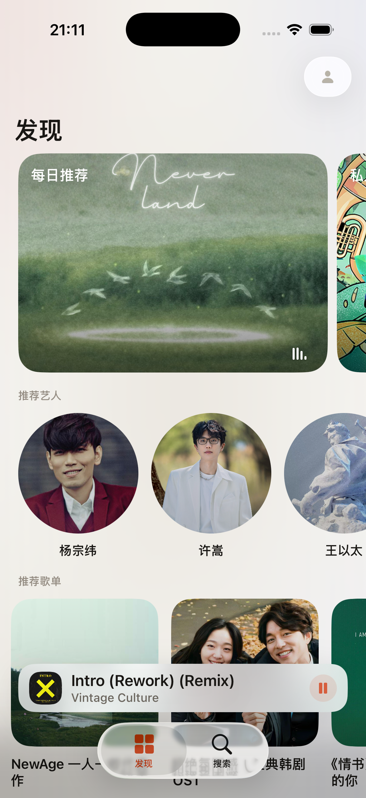
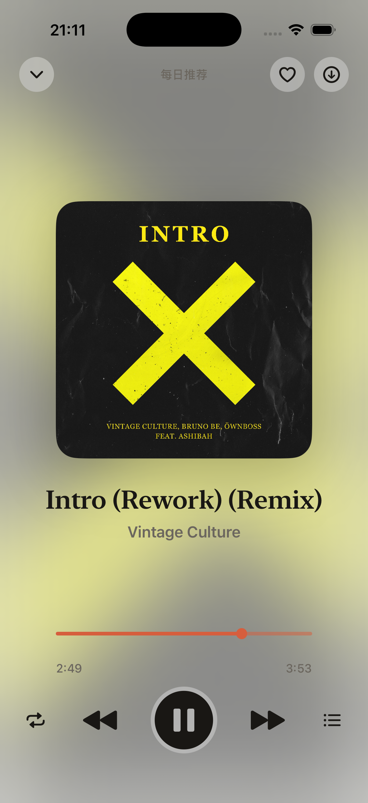
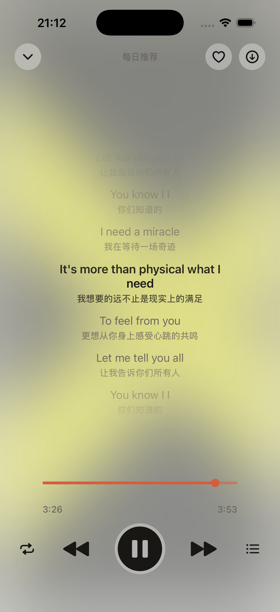

# Oto

Oto 是一个基于 SwiftUI 构建的 iOS 音乐应用，围绕网易云音乐生态提供发现、搜索、专辑/歌手/歌单浏览、后台播放、锁屏控制和离线下载等能力。

[English README](README.md)

## 截图

<p align="center">
  
  
  
</p>

## 亮点

- 使用 SwiftUI 构建，播放、会话、下载和缓存均由共享服务统一管理
- 基于网易云音乐接口提供发现页和个性化内容
- 全屏 Now Playing 界面，支持歌词、队列和播放控制
- 支持离线下载与播放/下载状态持久化

## 技术栈

- Swift 6
- SwiftUI
- Xcode 工程：`Oto.xcodeproj`
- iOS 最低部署版本：26.0
- 依赖：
  - [`NeteaseCloudMusicAPI-Swift`](https://github.com/Lincb522/NeteaseCloudMusicAPI-Swift)
  - `Nuke`

## 项目结构

- `Oto/` 应用源码
- `OtoTests/` 单元测试
- `Config/` 公开仓库可提交的匿名配置与本地覆盖模板
- `fastlane/` 发布自动化

## 环境要求

- Xcode 17 或更新版本，并已安装 iOS Simulator runtime
- Ruby / Bundler，用于 fastlane 相关工作流

## 开始使用

### 1. 克隆仓库

```sh
git clone https://github.com/Morris-Lau/Oto.git
cd Oto
```

### 2. 安装 Ruby 依赖

```sh
bundle install
```

### 3. 可选：配置本地签名覆盖

仓库中的 `Config/Identity.xcconfig` 使用的是公开安全的占位配置。

如果你需要在真机运行，或者进行 archive / TestFlight 打包，请先复制本地覆盖模板：

```sh
cp Config/Local.xcconfig.example Config/Local.xcconfig
```

然后填入：

- `APP_BUNDLE_ID`
- `APP_TEST_BUNDLE_ID`
- `APPLE_DEVELOPMENT_TEAM`

`Config/Local.xcconfig` 已加入 `.gitignore`，应始终只保留在本地。

## 构建

查看可用 scheme：

```sh
xcodebuild -project Oto.xcodeproj -list
```

在模拟器上构建：

```sh
xcodebuild -project Oto.xcodeproj -scheme Oto -destination 'platform=iOS Simulator,name=iPhone 17' build
```

## 测试

运行测试：

```sh
xcodebuild -project Oto.xcodeproj -scheme Oto -destination 'platform=iOS Simulator,name=iPhone 17' test
```

## 发布

Fastlane lanes：

```sh
bundle exec fastlane ios beta
bundle exec fastlane ios upload_testflight
```

如果要上传 TestFlight，还需要根据 `fastlane/Fastfile` 提供对应的 App Store Connect 环境变量或本地配置。

## 隐私与本地敏感信息

- 不要提交 `Config/Local.xcconfig`
- 不要提交 `.env`、描述文件、签名证书或本地部署脚本
- 任何设备相关或账号相关配置都应放在被忽略的本地文件中

## 参与贡献

提交 PR 前请先阅读 [CONTRIBUTING.md](CONTRIBUTING.md)。

## 安全问题

漏洞反馈方式请参考 [SECURITY.md](SECURITY.md)。

## 许可证

本项目使用 [MIT License](LICENSE)。

## 第三方软件

依赖许可证说明见 [THIRD_PARTY_NOTICES.md](THIRD_PARTY_NOTICES.md)。

## 致谢

- [`Lincb522/NeteaseCloudMusicAPI-Swift`](https://github.com/Lincb522/NeteaseCloudMusicAPI-Swift)：提供网易云音乐 Swift SDK
- [`kean/Nuke`](https://github.com/kean/Nuke)：提供图片加载与缓存能力
